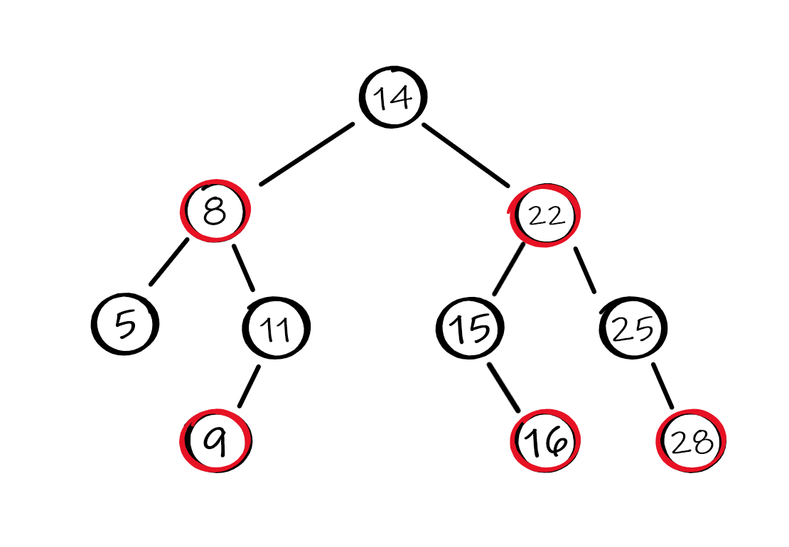

## Red-Black Tree

Red-Black Tree is a sorted data structure of type balanced binary search tree.
Each node stores 5 fields: pointers to his left son, right son, parent, date, and the color of the node (red or black).
The fact that the tree is balanced cause the running time of operation like search, insert and remove take O(log n).

The library include the following operation:
- create new tree
- insert element
- remove element
- search element
- forEach - preform given operation on every element in the tree. example: sum, print.
- delete tree

The library provides a generic data structure, so it works with any data type. The generic is implemented such that each node has a void pointer data field.
Because of that, the create new tree function expect to get compare function.

—————————————————————————————————————————

**To create the library** run the command make in a directory with the files RBTree.h and RBTree.cpp, this command create the static library RBTree.a.
After that you can like your program with the library, and run your program.

